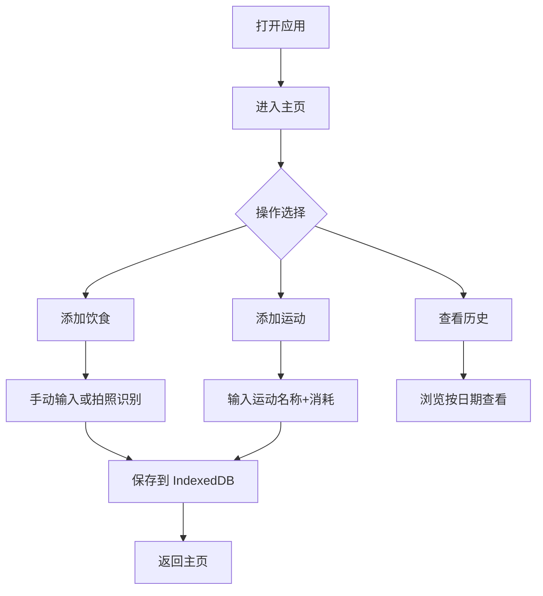

# 饮食热量记录工具 - PRD

## 1. Product Overview

一款基于 Web 的个人饮食与运动热量记录工具，帮助用户追踪每日热量摄入与消耗，自动计算热量差，通过 IndexedDB 实现本地数据持久化，无需注册登录即可使用。

- **核心价值**：让用户以极简的方式掌握每日热量平衡，支持拍照识别食物热量、手动录入饮食与运动记录、查看历史趋势。
- **目标用户**：关注身材管理/健身爱好者。

## 2. Core Features

### 2.1 Feature Module

1. **主页 Dashboard**：今日总摄入、今日总消耗、热量差值、快捷入口
2. **饮食记录页 Food**：手动添加食物热量 + 拍照识别食物热量
3. **运动记录页 Exercise**：手动添加运动消耗卡路里
4. **历史记录页 History**：按日期列表展示每日数据

### 2.2 Page Details

| Page Name | Module Name | Feature description |
|-----------|-------------|---------------------|
| 主页 | 数据卡片 | 展示今日日期、总摄入(kcal)、总消耗(kcal)、热量差(kcal)（带正/负色彩区分 |
| 主页 | 快捷入口 | 跳转到饮食、运动、历史页 |
| 饮食记录页 | 手动添加 | 食物名称 + 热量输入，支持删除记录 |
| 饮食记录页 | 拍照识别 | 选择/拍摄图片，调用外部 API 估算热量，确认后写入记录 |
| 运动记录页 | 手动添加 | 运动名称 + 时长/消耗卡路里输入 |
| 历史记录页 | 日期列表 | 按日期倒序，每日汇总摄入/消耗/差值，展开查看当日明细 |

## 3. Core Process

## 4. User Interface Design

### 4.1 Design Style

- **主色**：清新健康的青绿色系（Teal / Emerald），传递健康活力
- **辅色**：暖橙色用于摄入，蓝色用于消耗
- **字体**：标题使用现代圆润字体，正文使用清晰易读字体
- **风格**：卡片式布局，大圆角，柔和阴影，渐变背景
- **图标**：Lucide 图标库
- **动效**：卡片加载淡入，卡片入场动画，数字变化时的过渡效果

### 4.2 Page Design Overview

| Page Name | Module Name | UI Elements |
|-----------|-------------|-------------|
| 主页 | Dashboard 顶部问候语 + 日期、三个大数字卡片（摄入 / 消耗 / 差值）、底部快捷入口按钮 |
| 饮食记录页 | 顶部日期切换、「拍照识别」按钮、手动输入表单、记录列表（食物名称+热量） |
| 运动记录页 | 顶部日期、手动输入表单（运动名称+消耗卡路里）、记录列表 |
| 历史记录页 | 日期筛选、每日汇总卡片、可展开的每日明细 |

### 4.3 Responsiveness

- **桌面端优先设计，移动端自适应（最大宽度容器，垂直排列）
- 手机端优化触摸友好的表单和按钮尺寸（40px+ 点击热区

## 5. 功能规格

### 5.1 食物热量识别

- 手动录入：食物名称（文本框 + 热量（数字，单位 kcal）
- 拍照识别：使用 Google Gemini API 或 Vision API 进行食物识别与热量估算
- 识别结果以可编辑弹窗供用户确认后保存

### 5.2 运动记录

- 运动名称（文本）+ 消耗卡路里（数字）
- 可删除单条记录

### 5.3 数据存储

- 全部数据存储于浏览器 IndexedDB
- 数据结构：按日期字符串 (YYYY-MM-DD) 聚合
- 支持离线使用
