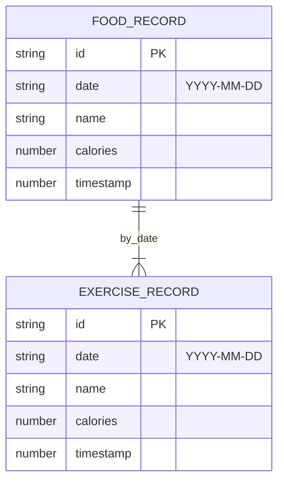

# 饮食热量记录工具 - 技术架构

## 1. Architecture Design

```mermaid
graph TD
  A[Vue 3 + Vite 前端] --> B[Vue Router 路由层]
  B --> C[Composables 状态管理
  A --> D[Tailwind CSS 样式层]
  A --> E[IndexedDB 本地数据库]
  A --> F[外部 AI 视觉 API]

  subgraph Browser
    E
  end
```

## 2. Technology Description

* **前端**：Vue 3 + TypeScript + Vite 6

* **路由**：vue-router\@4

* **样式**：Tailwind CSS 3

* **图标**：lucide-vue-next

* **本地数据库**：原生 IndexedDB API（封装为 composable）

* **拍照识别**：外部 AI Vision API（Google Gemini Vision / 或用户自定义 API Key）

## 3. Route Definitions

| Route       | Page Component   | Purpose      |
| ----------- | ---------------- | ------------ |
| `/`         | HomePage.vue     | 主页 Dashboard |
| `/food`     | FoodPage.vue     | 饮食记录页        |
| `/exercise` | ExercisePage.vue | 运动记录页        |
| `/history`  | HistoryPage.vue  | 历史记录页        |

## 4. Data Model

### 4.1 Data Model Definition



### 4.2 IndexedDB Schema

```ts
// Database name: 'calorie-tracker'
// Version: 1

interface FoodRecord {
  id: string;          // 主键，自动生成 UUID
  date: string;        // 索引 YYYY-MM-DD
  name: string;        // 食物名称
  calories: number;    // 热量 kcal
  timestamp: number;   // 创建时间戳
}

interface ExerciseRecord {
  id: string;
  date: string;
  name: string;        // 运动名称
  calories: number;    // 消耗 kcal
  timestamp: number;
}

// Object Stores:
// - 'foods':  { keyPath: 'id', indexes: { date: { unique: false } } }
// - 'exercises': { keyPath: 'id', indexes: { date: { unique: false } } }
```

## 5. 项目目录结构

```
src/
├── main.ts              # 入口
├── App.vue              # 根组件（含底部导航
├── router/index.ts      # 路由配置
├── composables/
│   └── useDB.ts         # IndexedDB 封装
├── components/
│   ├── BottomNav.vue    # 底部导航
│   └── StatCard.vue     # 数据统计卡片
├── pages/
│   ├── HomePage.vue
│   ├── FoodPage.vue
│   ├── ExercisePage.vue
│   └── HistoryPage.vue
└── utils/
    └── date.ts           # 日期工具
```

## 6. 拍照识别实现方案

由于纯前端没有后端服务，使用 Google Gemini Vision API（或类似视觉 API）实现食物识别：

1. 用户上传/拍摄图片 → 转为 Base64
2. 前端调用 `https://generativelanguage.googleapis.com/v1beta/models/gemini-2.0-flash:generateContent`
3. Prompt: "请识别这张图片中的食物，估算每份食物的热量（kcal），以 JSON 格式返回：{ items: \[{ name: string, calories: number }]"
4. 用户在弹窗中确认或修改结果后写入 IndexedDB

**注意**：API Key 需在运行前由用户配置（通过 `.env` 环境变量 `VITE_GEMINI_API_KEY`）。

## 7. 核心 Composable — useDB.ts

```ts
// 封装 IndexedDB 操作：
// - addFood(record): Promise<void>
// - addExercise(record): Promise<void>
// - deleteFood(id): Promise<void>
// - deleteExercise(id): Promise<void>
// - getFoodsByDate(date): Promise<FoodRecord[]>
// - getExercisesByDate(date): Promise<ExerciseRecord[]>
// - getAllDatesSummary(): Promise<{ date, intake, burn }[]>
```

## 8. 技术原则

* **纯前端应用**：无后端，所有数据本地化

* **离线可用**：首次加载后可完全离线使用（拍照识别除外）

* **隐私友好**：数据不出浏览器

* **零构建复杂**：仅用 Vue 3 + Tailwind + 轻量 composables

